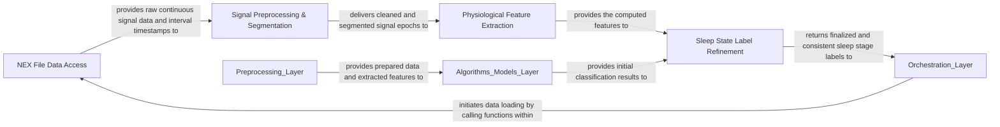

## Details

The `Data Ingestion & Preprocessing` component is a critical part of the WUCSS analysis pipeline, responsible for transforming raw `.nex` file data into a clean, feature-rich format suitable for sleep stage classification. It acts as an intermediary between the raw data source and the core analytical algorithms.

### NEX File Data Access

This sub-component is the primary interface for interacting with proprietary `.nex` and `.nex5` files. Its core function is to read raw continuous signal data (e.g., EEG, EMG) and extract time-based interval information (e.g., sleep/wake periods). It parses these binary files into usable Python data structures, making the raw data accessible for subsequent processing stages.

**Related Classes/Methods**:

- `Nex5CustomReader` (1:100)

- `read_continuous_variables` (1:100)

- `read_interval_variables` (1:100)

- `read_event_variables` (1:100)

### Signal Preprocessing & Segmentation

This sub-component takes the raw continuous signal data obtained from the `NEX File Data Access` and performs initial data preparation. This includes segmenting the continuous signals into discrete, usable epochs (fixed-duration time windows) and applying filtering to remove noise or artifacts. It also incorporates logic for handling minimum segment lengths and time thresholds to ensure that only valid and sufficiently long data segments are passed on.

**Related Classes/Methods**:

- `get_continous_during_interval` (1:100)

### Physiological Feature Extraction

This sub-component is dedicated to computing a rich set of physiological features from the preprocessed signal epochs. These features are quantitative descriptors of the signal characteristics, such as power in specific frequency bands (e.g., slow oscillation, delta, spindle), signal amplitude, and entropy. It leverages a suite of helper functions for the actual mathematical computations.

**Related Classes/Methods**:

- `extract_features` (1:100)

- `get_timestamps_for_epochs` (1:100)

- `extract_rem_ratio_feature` (1:100)

- `extract_power_band_feature` (1:100)

- `extract_amplitude_feature` (1:100)

- `extract_entropy_feature` (1:100)

### Sleep State Label Refinement

This sub-component is responsible for the post-classification refinement and merging of sleep state labels. It applies logical rules and optimization techniques to ensure the consistency and biological plausibility of the automatically assigned sleep stages. This often involves optimizing thresholds for distinguishing between different sleep states (e.g., NREM vs. REM).

**Related Classes/Methods**:

- `compute_and_optimize_rem_cluster` (1:100)

- `compute_silhouettes_rem` (1:100)

- `silhouette_analysis` (1:100)

- `GaussianMixture_sleep_classification` (1:100)

### [FAQ](https://github.com/CodeBoarding/GeneratedOnBoardings/tree/main?tab=readme-ov-file#faq)