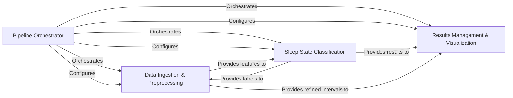

## Details

The WUCSS project, a Scientific Data Analysis Pipeline, is designed with a modular and data-centric architecture, focusing on clarity, reusability, and reproducibility. The pipeline orchestrates the flow from raw data ingestion to sleep state classification and final results reporting.

### Pipeline Orchestrator

The central control unit that manages the overall workflow of the sleep state classification pipeline. It defines the sequence of operations, handles file paths, and orchestrates calls to various processing stages. It also manages and passes configuration parameters to downstream components, ensuring consistent execution.

**Related Classes/Methods**:

- <a href="https://github.com/Roche/WUCSS/blob/main/wucss_main_task.py#L1-L1" target="_blank" rel="noopener noreferrer">`wucss_main_task` (1:1)</a>

### Data Ingestion & Preprocessing [[Expand]](./Data_Ingestion_Preprocessing.md)

Responsible for interacting directly with NEX files to read raw continuous signal data and extract time-based interval information. It performs initial data preparation steps such as filtering, segmentation into usable epochs, and handles post-classification refinement and merging of sleep state labels to ensure logical consistency. This component also extracts various physiological features (e.g., power bands, amplitude, entropy) from the preprocessed signal epochs.

**Related Classes/Methods**:

- <a href="https://github.com/Roche/WUCSS/blob/main/functions/nexfile_custom.py#L1-L1" target="_blank" rel="noopener noreferrer">`functions.nexfile_custom` (1:1)</a>

- <a href="https://github.com/Roche/WUCSS/blob/main/functions/wucss1_functions.py#L1-L1" target="_blank" rel="noopener noreferrer">`functions.wucss1_functions` (1:1)</a>

- <a href="https://github.com/Roche/WUCSS/blob/main/functions/wucss2_functions.py#L1-L1" target="_blank" rel="noopener noreferrer">`functions.wucss2_functions` (1:1)</a>

### Sleep State Classification

Implements the core machine learning algorithms for classifying sleep stages (REM, Light NREM, Deep NREM). It includes routines for clustering and optimizing the classification based on the extracted features.

**Related Classes/Methods**:

- <a href="https://github.com/Roche/WUCSS/blob/main/wucss_main_task.py#L1-L1" target="_blank" rel="noopener noreferrer">`wucss_main_task` (1:1)</a>

- <a href="https://github.com/Roche/WUCSS/blob/main/functions/wucss1_functions.py#L1-L1" target="_blank" rel="noopener noreferrer">`functions.wucss1_functions` (1:1)</a>

### Results Management & Visualization

Handles the persistence of final analysis results and generates various visual outputs. It saves classified sleep stage intervals and other tabular data into structured files (e.g., CSV) and creates visual representations such as hypnograms, figures for threshold optimization, cluster visualizations, and sleep state transition matrices.

**Related Classes/Methods**:

- <a href="https://github.com/Roche/WUCSS/blob/main/wucss_main_task.py#L1-L1" target="_blank" rel="noopener noreferrer">`wucss_main_task` (1:1)</a>

- <a href="https://github.com/Roche/WUCSS/blob/main/functions/wucss1_functions.py#L1-L1" target="_blank" rel="noopener noreferrer">`functions.wucss1_functions` (1:1)</a>

### [FAQ](https://github.com/CodeBoarding/GeneratedOnBoardings/tree/main?tab=readme-ov-file#faq)